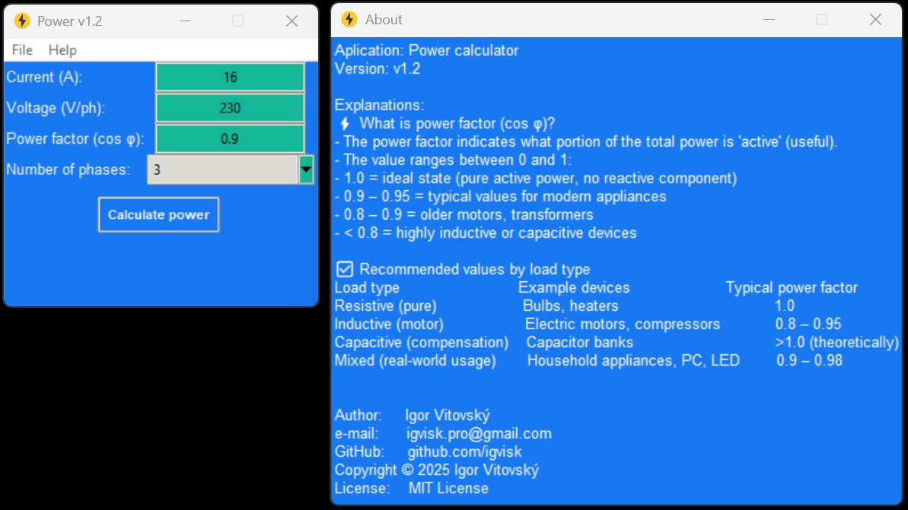

# ⚡ Power Calculator

[](LICENSE)  
A simple yet powerful desktop app for calculating active, reactive, and apparent power in 1-, 2-, and 3-phase AC systems. Built with Python and Tkinter.

---

## ✨ Features

- **Power Calculations:**
  - Active Power (P) – useful power
  - Reactive Power (Q) – inductive/capacitive component
  - Apparent Power (S) – total power

- **Supports:**
  - 1-phase (230 V)
  - 2-phase (L1–L2, 400 V)
  - 3-phase (400 V)

- **Smart Input Handling:**
  - Auto-corrects voltage based on phase selection
  - Highlights invalid voltage ranges with red background
  - Accepts both comma and dot as decimal separator

- **Quick Testing Presets**

- **Modern UI with custom `ttk.Style`**

- **Keyboard Shortcuts:**
  - `Ctrl+N` – New calculation
  - `Ctrl+Q` – Quit app
  - `F1` – About window
  - `ESC` – Close About window

- **About Window:**
  - Explains power factor (cos φ)
  - Lists typical values for common loads

---

## 🧮 Calculation Logic

Power is calculated based on the number of phases and user input:

- **Apparent Power (S):**
  - 1-phase: \( S = U \cdot I \)
  - 2-phase: \( S = U \cdot I \)
  - 3-phase: \( S = \sqrt{3} \cdot U \cdot I \)

- **Active Power (P):** \( P = S \cdot \cos\phi \)

- **Reactive Power (Q):** \( Q = S \cdot \sin\phi \), where \( \sin\phi = \sqrt{1 - \cos^2\phi} \)

- **Voltage Auto-Correction:**
  - 1-phase: if voltage ≥ 301 V → reset to 230 V
  - 2/3-phase: if voltage ≤ 300 V → reset to 400 V
  - Input field is styled red if voltage is out of expected range

---

## ⚡ How to Use

1. Enter current (A), voltage (V/ph), and power factor (cos φ)
2. Select number of phases (1, 2, or 3)
3. Click “Calculate Power” or press `Ctrl+N`
4. Results will appear at the bottom:
   ```
   Active power (P):      xxx.xx W
   Apparent power (S):    xxx.xx VA
   Reactive power (Q):    xxx.xx VAr
   ```

---

## 🖼️ Preview
  
[]

---

## 🚀 Getting Started

### Requirements
- Python 3.8+
- Tkinter (included with standard Python)

### Run the App

**English version:**
```bash
python Power_calculator.py
```

**Slovak version:**
```bash
python Power_calculator_sk.py
```

---

## 📄 License

This project is licensed under the MIT License.  
© 2025 Igor Vitovský

---

